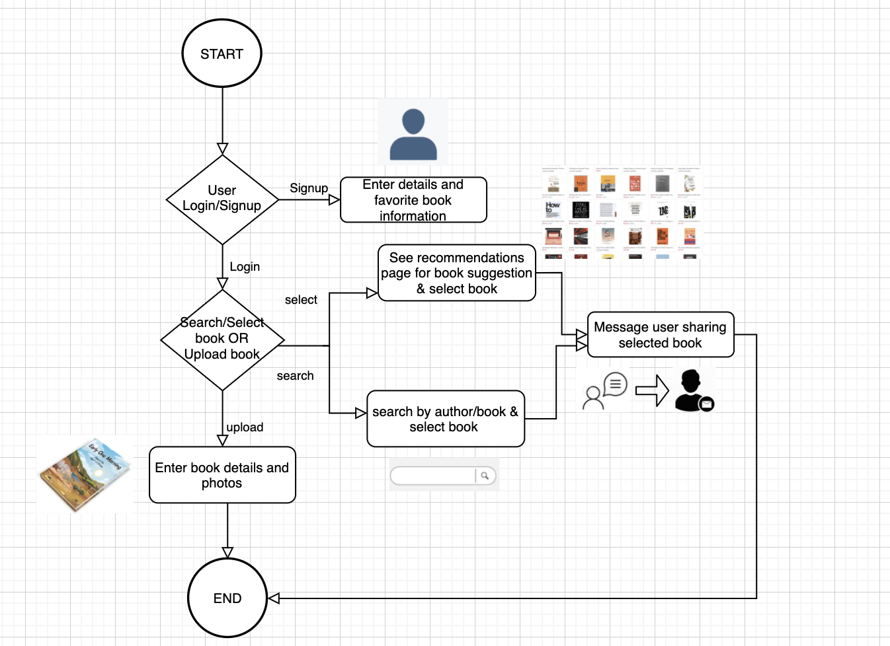

 

## Project Idea

### Project Title: BookSwap App.
# Approved

Project Idea Description: A money free Barter System market place where people can share their books on "1-1" swap basis.   Users can upload the list of books they are willing to share or swap and a list of books/genres  they are interested in. Using ML, based on user's interest the app will recommend you books you may like and also if the book is available in system for swapping. Users can decide time and Space and can exchange books in the message window.All user conversations can be seen in message tab.User can search for books using bookname and author name in dashboard page and see list of all available books.
User can view book details as mentioned by book owner and also owner of the book and send message to book owner if interested.
      
Goal/Intended clients: Provide a safe a convenient and safe marketspace or all people who have books that are collecting dust on their shelves and due to sentiment or intended future use, the clients are not interested in selling them.  For all such users the app provides a safe space among familiar faces to exchange their books on temporary basis and get access to a wide range of books without  wasting money, especially if they hate ebooks and tablets like kindle, and love the feel of  a solid book in their hands and enjoy turning pages rather than swiping on screens . Revenue can be generated by charging membership fees or targeting added based on book preferences. No payment for books. 

#### Technology Stack:     
Front end: Html5+ Css, Javascript and ReactJS   
Backend : Python,NodeJS, Flask   
Databases: MongoDB   
Deployment:Amazon EC2 Instance    
Machine Learning: Tensorflow   

#### Architecture Diagram:   
   
    
   
#### Flow Diagram:     
   
 
                           

