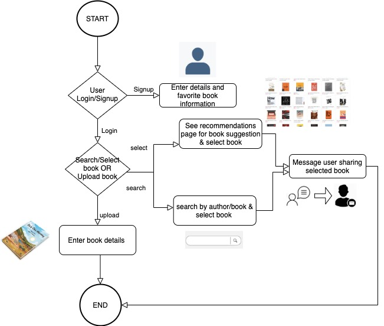

 

## BookSwap

### Project Idea  
BookSwap application provides its users with a simple platform where they can share and borrow books with other bibliophiles like them. BookSwap is a web application which facilitates users to swap books within a specified radius and provide a flexibility to the users to contact and discuss the place and time of swap or select from one of the locations suggested by the application.

### Abstract
Project Idea Description: A money free Barter System market place where people can share their books on swap basis.   Users can upload the list of books they are willing to share or swap and a list of books/genres  they are interested in. Using ML, based on user's interest the app will recommend you books you may like and also if the book is available in system for swapping. Users can decide time and Space and can exchange books in the message window or select from one of the swap locations suggested by the app. All user conversations can be seen in message tab.User can search for books using bookname or author name or based on category in dashboard page and see list of all available books.Our app also facilitates type ahead search. The dashboard feed is personalized based on the users previous swap history preferencing the books will mostly be liked by him on first page and rest all following it. User can view the requests for swap books in the requests tab and also view their history of swapped books in the profile page. 
      
Goal/Intended clients: Provide a safe a convenient and safe marketspace or all people who have books that are collecting dust on their shelves and due to sentiment or intended future use, the clients are not interested in selling them.  For all such users the app provides a safe space among familiar faces to exchange their books on temporary basis and get access to a wide range of books without  wasting money, especially if they hate ebooks and tablets like kindle, and love the feel of  a solid book in their hands and enjoy turning pages rather than swiping on screens . Revenue can be generated by charging membership fees or targeting added based on book preferences. No payment for books. 

#### Technology Stack:     
Front end: Html5+ Css, Javascript and ReactJS   
Backend : Python,NodeJS, Flask   
Databases: MongoDB   
Deployment:Amazon EC2 Instance    
Machine Learning: Tensorflow   

#### Architecture Diagram:   
   
    
   
#### Flow Diagram:     
   
 
                           

